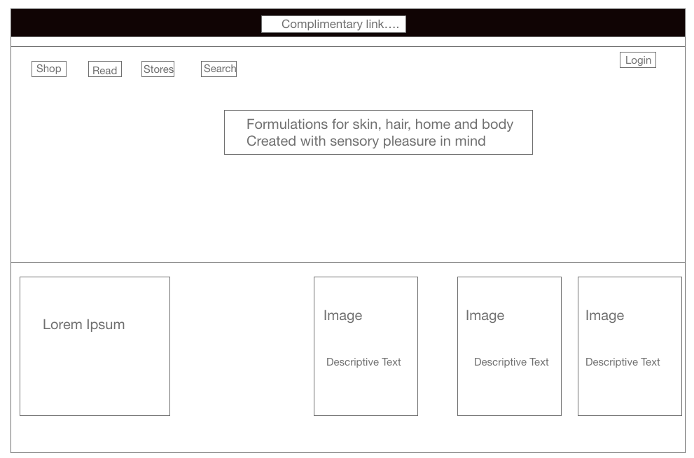

#### Group Assignment Project

#### Objective

1. To creata a mock-up of Aesop website by working in a group
2. The leader of the group will use their github repo and add their teammates as collaborators.
3. Create a branch for each team mate.
4. Assign tasks amongst each other

#### Wireframe

